# Exercise 3

Answers to Exercise 3

---

## Questions

### Question 1
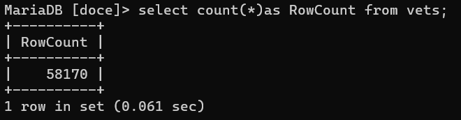

### Question 2
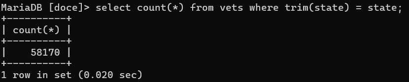

### Question 3

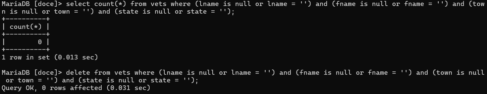

The first statement above shows the count of empty rows within the vets table, 83. The second statement is the query to delete those empty rows, and you can see that 83 rows were affected.

### Question 4
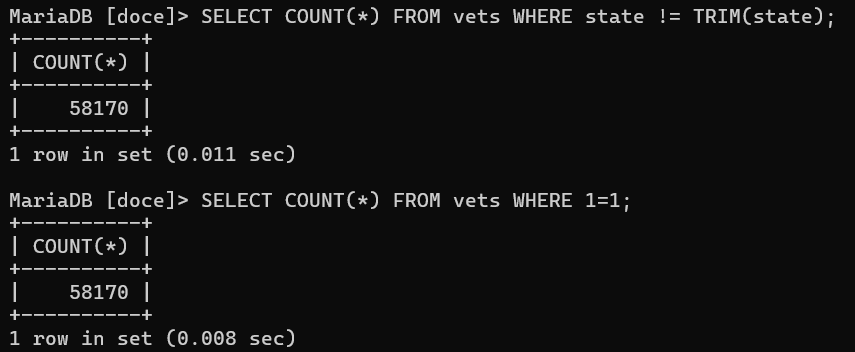
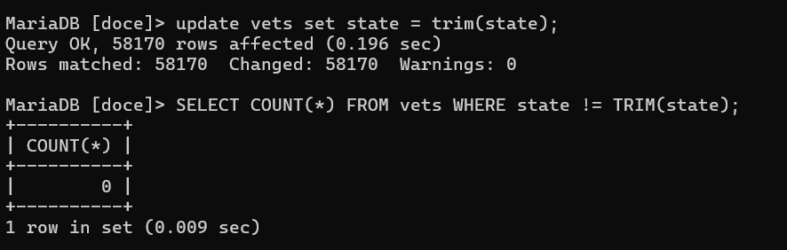

### Question 5
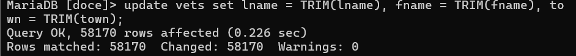
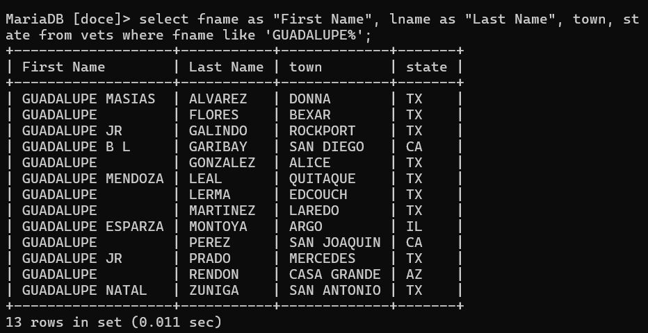

### Question 6
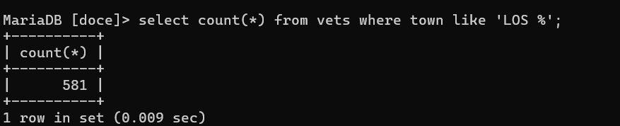

### Question 7
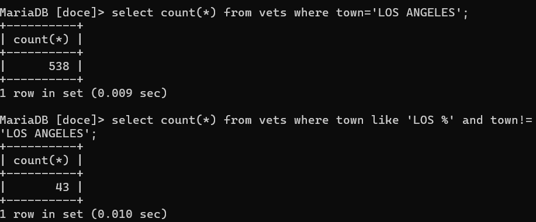

### Question 8
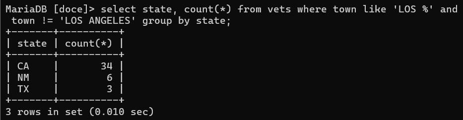

### Question 9
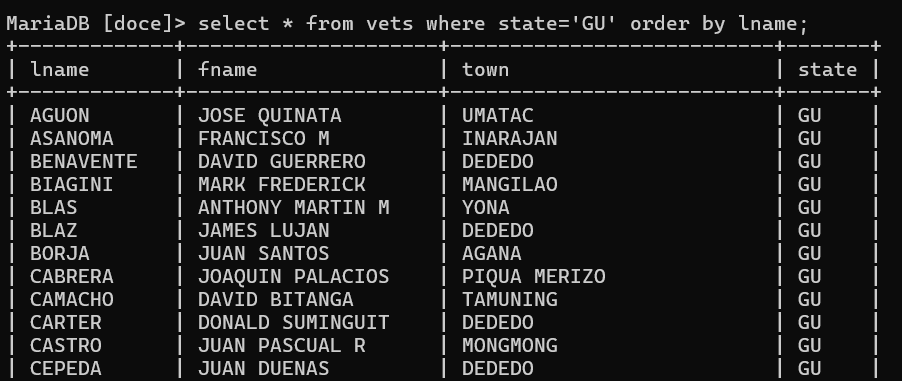

