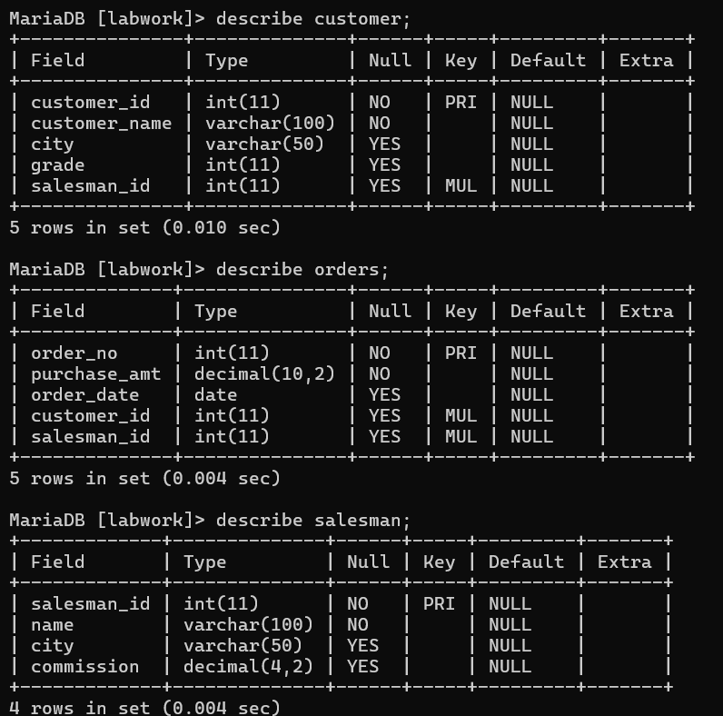
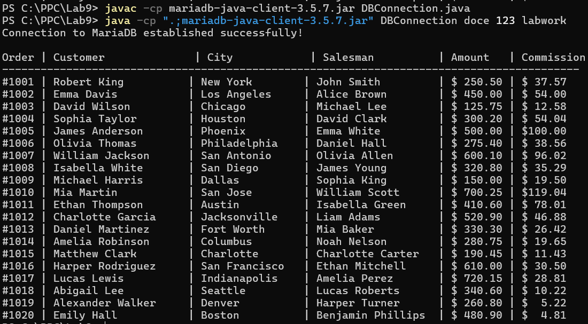

# Exercise 9 - labwork Database Connection

## Files
[DBConnection.java](DBConnection.java) - Main program + Sales class

---

## Database Tables


---

## Program Output


---

## How to Run
```bash
javac -cp mariadb-java-client-3.5.7.jar DBConnection.java
java -cp ".;mariadb-java-client-3.5.7.jar" DBConnection username password labwork
```
